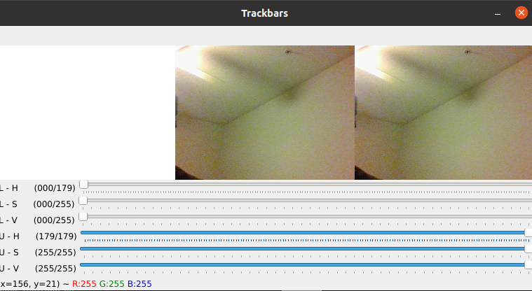

# Ped-algorithm
Algorithm that returns pedistal pickup order using machine learning, game board mapping, graphs.

# Install Dependendices
This project works the best in python 3.7.5
Use the command "pip install -r requirements.txt" to install the the libraies nesscary to use the project

# Color Detection

## color_range.py
Allows you to adjust HSV(color scale) values to find the color of object you are looking for.HSV scale is better for brightness adjustment and finding the color white.
HSV Tracker                     

## color_detect.py
A sample color detection script that detects the basic colors

## rgb_detect.py
Allows you to adjust RGB(color scale) values to find the color of the object you are looking for.
